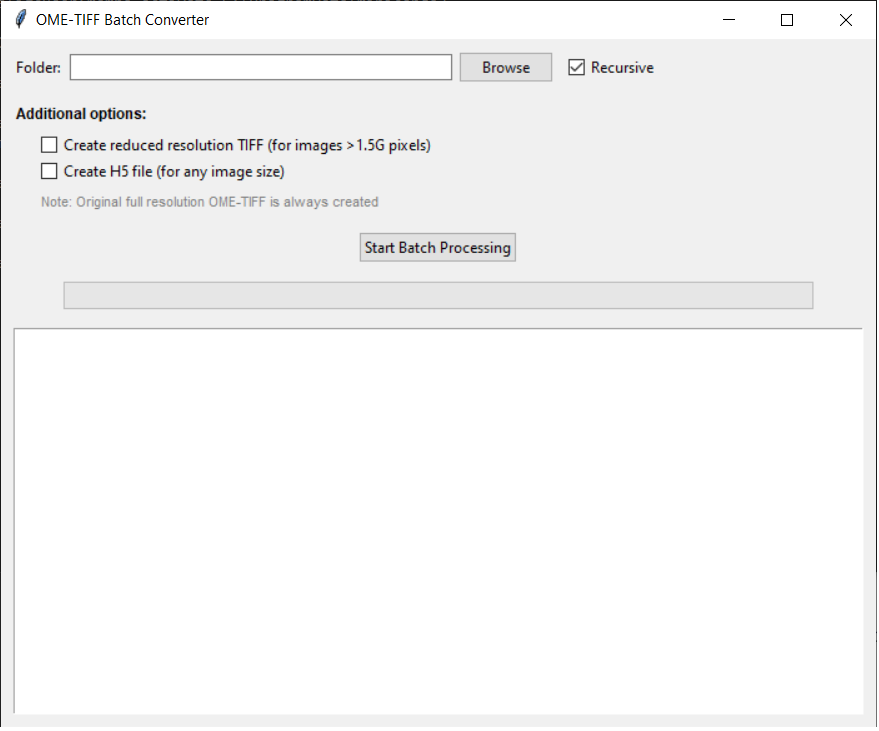

# Montage Blend and Convert

A GUI application that blends SerialEM montages (.mrc + .mdoc) with IMOD and writes calibrated, pyramidal OME-TIFF, with optional BigDataViewer-compatible HDF5 and reduced-resolution derivatives for very large montages.



## What it does

This tool processes SerialEM montage files (.mrc + .mdoc) and converts them to:
- **OME-TIFF files** with correct pixel size calibration and pyramidal structure (always created)
- **HDF5 files** (optional, any image size), compatible with ImageJ BigDataViewer
- **Reduced resolution TIFF files** (optional) for montages above 1.5G pixels - can be created independently of HDF5

The processing includes:
1. Montage blending using IMOD tools (extractpieces + blendmont)
2. Conversion to calibrated OME-TIFF with pyramid levels (always created)
3. Optional HDF5 creation, independent of image size
4. Optional reduced resolution TIFF creation for montages above 1.5G pixels

## Prerequisites

### Required Software

1. **Cygwin** (Windows Unix environment)
   - Download from: https://cygwin.com/
   - Install to: `C:\cygwin64\` (recommended)
   - **Required packages during installation:**
     - Base packages (automatically selected)
     - gcc-core, gcc-g++ (for compilation)
     - make, cmake (build tools)

2. **IMOD** (Image processing software)
   - Download from: https://bio3d.colorado.edu/imod/
   - **Install IMOD inside Cygwin environment**
   - Required tools: `extractpieces`, `blendmont`
   - After installation, verify tools are accessible in Cygwin

### Installation Instructions

#### Step 1: Install Cygwin
1. Download Cygwin installer from https://cygwin.com/
2. Run installer and install to `C:\cygwin64\`
3. During package selection, ensure these are included:
   - gcc-core, gcc-g++
   - make, cmake
   - wget, curl (for downloading)

#### Step 2: Install IMOD
1. Download IMOD from https://bio3d.colorado.edu/imod/
2. Install IMOD following their instructions for Cygwin
3. **Verify installation:**
   ```bash
   # Open Cygwin terminal and test:
   which extractpieces
   which blendmont
   ```
   Both commands should return valid paths.

#### Step 3: Verify Installation
Run the verification script:
```bash
python check_standalone_ready.py
```

This will check:
- Python packages installation
- Cygwin accessibility
- IMOD tools availability
- Disk space

## Usage

### Option 1: Use Pre-built Executable
1. Download `OME_TIFF_Batch_Converter.exe`
2. Double-click to run the application
3. **No Python installation required!**

### Option 2: Run from Source
1. Install Python dependencies:
   ```bash
   pip install -r requirements.txt
   ```
2. Run the application:
   ```bash
   python ome_tiff_batch_gui_v2.py
   ```

### Using the Application

1. **Select Folder**: Choose folder containing .mrc files
2. **Options**:
   - ✅ **Recursive**: Search subfolders for .mrc files
   - ✅ **Create H5 file**: Creates HDF5 files compatible with BigDataViewer (any image size)
   - ✅ **Create reduced resolution TIFF**: Creates downsampled TIFF files, for montages above 1.5G pixels only
   - **Note**: Both options are independent - you can select none, one, or both

3. **Processing**: Click "Start Batch Processing"

### Output Files

For each input file `image.mrc`, the tool creates:

**Always created:**
- `image.ome.tif` - Original resolution OME-TIFF with calibration

**Optional files:**
- `image.h5` + `image.xml` - HDF5 format for BigDataViewer, any image size (if "Create H5 file" is checked)
- `image_reduced.ome.tif` - Reduced resolution TIFF, montages above 1.5G pixels only (if "Create reduced resolution TIFF" is checked)

**Note**: you can choose to create:
- Only HDF5 files
- Only reduced resolution TIFF
- Both HDF5 and reduced TIFF
- Neither (only original OME-TIFF)

### Opening Results

- **OME-TIFF files**: Open directly in ImageJ/Fiji
- **HDF5 files**: Use BigDataViewer plugin in ImageJ
  - `Plugins > BigDataViewer > Open XML/HDF5`
  - Select the `.xml` file

## Building Standalone Executable

```bash
python create_standalone.py
```

This creates `dist/OME_TIFF_Batch_Converter.exe`

## File Requirements

Each .mrc file must have a corresponding .mdoc file with the same name:
- `montage001.mrc` → `montage001.mrc.mdoc`

The .mdoc file must contain a `PixelSpacing` entry for calibration.

## Troubleshooting

### Common Issues

1. **"Cygwin not found"**
   - Ensure Cygwin is installed in standard location
   - Check paths in error message

2. **"IMOD tools not found"**
   - Verify IMOD installation in Cygwin
   - Test `extractpieces` and `blendmont` in Cygwin terminal

3. **"No .mdoc file found"**
   - Ensure .mdoc files exist alongside .mrc files
   - Check file naming convention

4. **"Could not read pixel size"**
   - Verify .mdoc file contains `PixelSpacing = X.X` line
   - Check file encoding (should be UTF-8 or ASCII)

### Verification Tools

- `check_standalone_ready.py` - Comprehensive system check
- Test with small files first
- Check Windows Event Viewer for detailed error logs

## Technical Details

### Supported Formats
- **Input**: SerialEM .mrc montages with .mdoc metadata
- **Output**: OME-TIFF (pyramidal), HDF5 + XML (BigDataViewer)

### Processing Pipeline
1. Extract pieces from montage using IMOD `extractpieces`
2. Blend montage using IMOD `blendmont`
3. Convert to OME-TIFF with proper calibration
4. Generate pyramid levels for efficient viewing
5. Optional HDF5 creation, independent of image size
6. Optional reduced resolution TIFF for montages above 1.5G pixels, downsampled towards a 1G pixel target

### Calibration
- Pixel size read from .mdoc `PixelSpacing` field (in Ångström)
- Automatically converted to micrometers for OME-XML
- Pyramid levels maintain correct calibration ratios

## License

This software is provided as-is for research purposes. Please cite appropriately if used in publications.

## Support

For issues or questions:
1. Check this README
2. Run verification scripts
3. Check GitHub issues
4. Ensure all prerequisites are correctly installed 